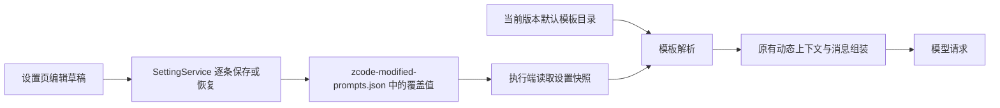

# 内置提示词编辑

状态：已实现。范围为下表中的 13 项 Agent／系统提示词及辅助提示词，覆盖值使用独立文件保存。

## 产品范围

在设置的「智能体能力」分组新增「内置提示词」。以当前执行端的用户级设置为范围，不增加项目级覆盖、模型级覆盖或云同步机制。

| 分组         | 可编辑条目                                           | 当前来源                                                                                                                |
| ------------ | ---------------------------------------------------- | ----------------------------------------------------------------------------------------------------------------------- |
| 主 Agent     | 产品身份前缀、身份与基础规则                         | `core/src/context/sections/cli-prefix.ts`、`identity.ts`                                                                |
| 主 Agent     | 沟通与执行规则、上下文管理规则、按工具启用的会话指导 | `core/src/context/dynamic-sections.ts`                                                                                  |
| 主 Agent     | 桌面说明、记忆使用规则                               | `core/src/context/sections/desktop.ts`、`memory.ts`                                                                     |
| 内置子 Agent | general-purpose、Explore                             | `core/src/subagent/general-purpose.ts`、`explore.ts`                                                                    |
| 辅助功能     | 会话／目标标题（当前共用同一模板）                   | `core/src/runtime/methods/title-generation-sidecar.ts`                                                                  |
| 辅助功能     | Git 提交消息、上下文压缩、记忆提取                   | `packages/services/src/git/gitCommitMessageGenerator.ts`、`core/src/compact/prompt.ts`、`core/src/memory/extraction.ts` |

表中的 `core` 指 `apps/zcode-cli/packages/core`。这是首版明确接入清单，不代表仓库只有这些提示词。工具 description、协议通知、工作流内部模板、插件提供的提示词不在本轮批量改造范围。

运行时的日期、目录、Git 信息、可用工具、技能目录、历史对话及 AGENTS.md 正文继续由现有链路提供。页面编辑的是模板，不把某次会话的动态数据保存成默认提示词。子 Agent 的工具权限仍由现有代码控制。

## 编辑交互

- 左侧为用途列表及「默认／已修改」状态，右侧为说明、文本编辑区与该条目的生效范围。
- 复用已有设置布局、按钮和文本编辑组件，提供保存、放弃修改、恢复该项默认、查看当前版本默认内容；离开有未保存草稿的条目时提示。
- 初次显示实际默认文案；恢复默认删除该条覆盖，不把旧默认文案再保存为覆盖。
- 提示词正文可直接修改，不添加针对管理员的内容审查或隐藏的文本替换。
- 空白正文不允许保存；删除自定义内容使用「恢复默认」，不会把空字符串误当成默认值。
- 模板确有运行时插值时展示变量列表和用途；使用有限的命名变量替换，不引入模板引擎或可执行表达式。保存前检查未知／必要变量，JSON 示例中的普通花括号不被误识别。
- 标题条目说明现有 JSON `title` 输出要求，Git 条目说明 Conventional Commit 要求，压缩条目说明摘要标签要求。编辑提示词不改变下游解析器；不合规输出继续按原有失败处理。

## 默认值、持久化与实现边界

1. 在 `packages/shared` 增加纯数据的内置提示词目录：稳定 ID、用途、默认模板、变量描述。仅将接入范围内的静态文案抽出，原有调用者、条件分支、拼装顺序与消息 role 保持原位，不复制两份默认值、不新增 package。
2. 内置提示词覆盖单独保存到 `~/.zcode/v2/zcode-modified-prompts.json`，不改变原版 `setting.json` 的字段。由现有 SettingService 作为唯一写入入口，在进程间文件锁内逐条读取、合并、原子提交；不同窗口保存不同条目不会覆盖彼此。恢复默认删除该条覆盖。
3. UI 通过 hook 调用设置服务，页面只拥有未保存草稿。CLI bootstrap/adapters 通过公开端口读取当前执行端的覆盖快照并注入 runtime，core 不导入 Services、不自行读配置文件。Git 生成器从同一设置所有者读取。
4. 默认解析为「有覆盖则使用覆盖，否则读取当前版本默认模板」。无覆盖时生成内容与当前上游保持一致，包括分支条件、缓存标记和 token 统计；覆盖后重新计算文本长度和 token 估算。
5. 不直接复用 `customSystemPrompt`：当前 `ContextBuilder.build()` 的该分支会跳过默认身份、桌面、会话指导、记忆和环境等多段内容。此次是在原有分段组装位置替换对应模板，不切换到整段 system prompt 替代路径。
6. 原有 Output Style、自定义 Agent 和显式 systemPrompt 保留其现有优先级；内置模板覆盖仅影响使用这些内置模板的路径，不强行覆盖用户已选择的自定义模式。
7. 页面固定绑定 `useBaseWorkspaceServices` 所属应用主机，与本机模型设置一致，并明确标示作用域。Desktop 为本机 Host，Web 为其连接的应用服务器，手机 attachment 复用桌面 Host。激活独立 SSH 工作区不会切换本页的设置源，也不隐式复制设置到远端。

## 生效时机与升级

- 主 Agent 和内置子 Agent：根会话运行实例建立时读取快照，子 Agent 继承同一快照。存活实例继续使用原快照；页面提示新会话或重建运行实例后生效，不承诺热更新，也不改写历史消息。
- 独立辅助调用：下一次生成开始时读取最新设置，并在该次调用及重试期间固定；运行中不替换提示词。
- 上游升级时未覆盖条目自动使用新版默认，有覆盖条目保留用户文本；恢复默认切换到当前版本默认。暂不增加自动合并、历史版本库或逐版本迁移框架。
- 原始安全说明也是提示词正文的一部分，不为其增加额外锁定；实际工具权限和协议校验独立于文本。

## 版本共存与验收

### 与原版轮流使用

- 不更改应用名、单实例锁或现有用户数据根。两版依旧轮流运行，普通任务与原版支持的设置继续共用；此方案不承诺同时编辑同一任务的跨版本并发一致性。
- Provider 的 v1/v2 文件边界由 [ModelLink 配置](modellink-providers.md#持久化与原版轮流使用) 定义，不由提示词编辑功能重复实现。
- Prompt 编辑读写独立 JSON；原版 `setting.json` 的任何保存都不会删除覆盖值。两个版本保留各自的额外内容，普通共享内容的最新修改仍由当前运行的版本写入。

定向用例：

1. 无覆盖：代表性主 Agent、Explore 搜索分支及辅助模板与原实现文本等价。
2. 保存唯一标记：新实例或下次辅助调用的实际模型请求包含标记；环境、工具条件和消息 role 不变，不仅断言 UI 或配置文件。
3. 恢复默认、重启后保留覆盖、多窗口分别保存不同条目，均符合上述规则。
4. 运行期间保存：当前调用保持原快照，后续符合生效规则的调用使用新值；自定义 Agent／显式 systemPrompt 不被覆盖。
5. 变量检查与标题／Git 输出解析各保留一个高价值失败路径。
6. 一条设置页端到端场景覆盖编辑、保存、重新进入、恢复默认；验证 Desktop 与 Web 所指向的设置服务，手机复用 Host 的路径不新增独立运行时。

## 实际验证

- 2026-09-23 的 6 项定向测试通过：`packages/shared/test/builtinPrompts.test.ts`、`packages/services/test/builtinPromptSettings.test.ts`、`apps/zcode-cli/packages/adapters/test/builtin-prompt-runtime.test.ts`。从根目录通过 `pnpm exec tsx --test <files>` 执行，包含独立提示词文件与普通 setting.json 互不改写检查。
- 默认文案摘要来自移动前的基线实现，覆盖全部 13 项及身份／Explore／压缩的条件变体。HTTP 测试实际接收主会话、两个内置子 Agent 和标题请求，验证旧实例快照、新实例生效、辅助更新与恢复默认；Git 测试验证发给生成器的正文和原有输出校验。
- 现有 `modellink-auxiliary-runtime.test.ts` 通过，Chat／Responses 与辅助思维级别行为保留。
- 2026-09-22，`packages/ui/test/builtinPrompts.e2e.mjs` 的 `verifyBuiltinPromptEditor(page)` 在隔离 Web/Server 中执行通过：编辑、保存、重新进入、刷新后保留、默认预览、变量校验、未保存草稿保护及恢复默认。测试环境不使用真实账号；独立文件改造后重跑了存取与运行时测试，未重跑该 UI 场景，未执行 Electron 安装包交替启动验证。
- 根 `pnpm typecheck` 与 CLI 15 个包的类型检查通过；CLI 使用 `pnpm -r --filter './apps/zcode-cli/packages/**' typecheck` 直接执行包脚本。根 Lint 0 错误、70 条原有警告，CLI 改动文件的定向 Lint 保留原有警告。
- 架构检查 0 违规，改动文件格式与 `git diff --check` 通过。涉及 shared、services、ui、zcode-cli；设置服务是唯一持久化写入者，广播仅刷新视图。未修改模型传输协议。
- feature graph 包含提示词页面、目录、设置所有者和运行时快照节点；YAML、节点唯一性、关系端点／等级及新增源码符号校验通过。
