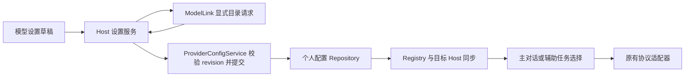

# ModelLink 渠道与辅助模型

状态：已实现，包含目录导入、构建默认地址、辅助模型/思维选择及原版配置保护。验证范围为源码、本地 HTTP 夹具与隔离设置界面；未完成桌面安装包交替启动验证。

## 渠道与构建配置

- 模板选择页提供 `ModelLink Chat` 和 `ModelLink Responses`，分别固定使用 OpenAI Chat Completions 和 Responses。复用现有个人渠道、模型编辑器与协议适配器，不自动切换协议。
- 每个渠道独立保存 Base URL/API Key，可以填写相同值。仓库不内置实际 ModelLink 地址；`ZCODE_MODELLINK_BASE_URL` 仅作为 Desktop/Web 构建时新建渠道的可编辑默认地址，不覆盖已有配置，Key 始终由用户填写。
- 使用原有 Vite ENV 加载与 define 注入；`.env.example` 中地址留空。该变量与 ZCode 控制面的 `ZCODE_BASE_URL` 独立。
- 普通供应商与通用自定义渠道保留。官方套餐 UI 开关见 [generic-model-channels.md](generic-model-channels.md)，不改变网关规则。
- 模型身份仍是 `providerId + modelId`。动态模型名单和在线能力来自目录，不硬编码数量或按模型名称分组。

## 目录与能力

1. 保存地址/Key 后由用户点击“获取模型”或刷新；Host 请求该渠道的 `/v1/models?include=modellink`，保留用户已有查询参数。缺少地址/Key 时不请求，不新增后台轮询服务。
2. ModelLink 响应须包含显式 `modellink` 扩展及客户端协议/能力信息。按首选协议导入对应渠道；旧服务没有扩展时明确失败，不按名称猜协议。此接口合同由 ModelLink 后端提供，其部署不属于本仓库构建。
3. 目录写入 `modelCatalogs` 快照，按 providerId 隔离，只保留归一化条目、来源与获取时间，不保存原始响应。目录条目的 ID 就是导入成员集合，不重复维护 importedModelIds。
4. 推荐顺序为随包通用规则 → ModelLink 默认值与目录 → 当前个人规则。刷新不覆盖用户手动规则；手动模式继续沿用现有整套参数覆盖语义。
5. 成功目录中下架的模型保留身份并标记不可选；历史会话不改指向，不自动换模型。目录失败保留已有快照。用户可显式转为手动管理。
6. 地址、Key 或渠道类型发生变化时，在同次提交中使旧目录失效；普通保存不清空目录。网络请求不持有写锁，提交前检查渠道与 revision，过期响应不覆盖新配置。

| 能力             | 规则                                                                                             |
| ---------------- | ------------------------------------------------------------------------------------------------ |
| 上下文和最大输出 | 使用明确目录值，覆盖名称猜测；缺失时保留未知并要求补齐，不把通用默认当成服务保证                 |
| 图像输入         | 仅按当前协议明确声明启用                                                                         |
| 音频、视频、PDF  | 两个 ModelLink 渠道固定关闭，编辑器不提供开启入口                                                |
| 工具             | 复用现有函数工具与协议编码；单项工具成功不代表所有工具形态可用                                   |
| 联网搜索         | 仅同步 `supportsNativeWebSearch` 标记，未知为 false；不补 ZCode 搜索适配能力，也不宣称可实际调用 |
| 结构化输出       | ModelLink 默认 true；目录明确 false 或手动关闭可覆盖，不增加严格输出实现或专项探测               |
| 推理             | 使用公开档位与默认值，按协议编码；不强加不存在的 none/off 档位                                   |

## 持久化与原版轮流使用

- 随包 `config/provider/zcode-builtin.json` 继续保存上游规则；ModelLink 配置、目录与辅助选择由现有个人配置 Repository 管理。
- 原版只接受 v1 的 `provider_config.json`。修改版默认使用同目录的 `provider_config.zcode-modified.json`，schemaVersion 为 2。
- 修改版文件缺席时，文件仓库只读原版配置并一次性建立 v2 快照，保留原有渠道、个人规则和默认选择；不升级写回原版文件。快照建立后，两版的模型配置不自动互相同步。
- 共存实现集中在 `PERSONAL_PROVIDER_CONFIG_FILE_NAME` 与现有文件仓库。Host、Agent、独立 CLI 和 provisioning 沿用原接口和默认路径常量，不添加各自的迁移分支。
- 应用名、单实例锁及普通用户数据目录保持原有语义；两版轮流使用。未验证同时编辑同一任务的跨版本并发行为。

v2 的新增字段为 `config.modelCatalogs` 与 `config.auxiliaryModelSelection`；后者保存 `providerId`、`modelId` 和 `options.reasoningLevel`。目录和辅助选择通过已有 provisioning 同步，不再写一份到 setting.json。

## 辅助模型

- 模型设置页提供一个公共“辅助文本模型”和“思维档位”选择器。可选任一已配置且可执行的模型，选项来自该模型的公开档位。
- 配置用于会话标题、目标小标题和 Git 提交说明。未设置时保持原行为：标题跟随当前会话，Git 使用目标 Host 的 preferredSelection；原有最低思维档位规则也仅在未配置独立选择时沿用。
- 有显式选择时，模型和思维档位一并传到实际请求。模型被删除/禁用、档位无效或请求失败时保留原有失败处理，不静默改用其他供应商，也不改变主对话选择。
- 上下文压缩、记忆提取、网页处理和会话检索继续沿用各自原有模型选择，不增加每类任务独立配置。

## 所有者与时序

- UI 只拥有草稿，模型目录由 ModelLink 提供；用户覆盖、导入快照和辅助选择由 ProviderConfigService/个人 Repository 唯一写入。
- 已开始的请求继续使用创建时冻结的选择；刷新或设置变化只作用于后续绑定。CLI 通过现有 ModelCatalogPort 读取，不新增 session/create 字段。
- 保留 workspace identity、owner/lease、远端目标 Host 校验；桌面 continuous 和手机 replayable 使用原有交付边界。

## 验证

- `packages/provider-node/test/modellinkCatalog.test.ts`：分协议导入、URL 查询、手动覆盖、目录失效、重启恢复及过期提交。
- `packages/services/test/providerConfigMigration.test.ts` 与 `providerConfigVersionCoexistence.test.ts`：配置迁移、原版文件不改写及修改版快照不被后续原版保存覆盖。
- `apps/zcode-cli/packages/adapters/test/modellink-auxiliary-runtime.test.ts`：实际 AgentRuntime/AI SDK 对本地 HTTP 夹具发出 Responses 主请求与指定 Chat/high 辅助请求，并验证工具续轮、图像和流式结束。
- 隔离界面已验证两种渠道创建、获取模型、辅助模型/档位重载保留；构建默认地址验证了未设置留空、设置后预填、已有地址不覆盖、用户修改后保留。
- 根与 CLI 类型检查、架构检查通过；根 Lint 无错误，有 70 条既有警告。CLI 全量 Lint 存在原有超长文件等错误，不报告为通过。
- 测试使用隔离数据目录，不使用真实账号。Web 原有 window-controller/SQLite 启动限制使设置页验证不能代替完整桌面聊天验证；未请求生产模型，未执行音频/视频/PDF、实际联网搜索或严格输出专项验证。
