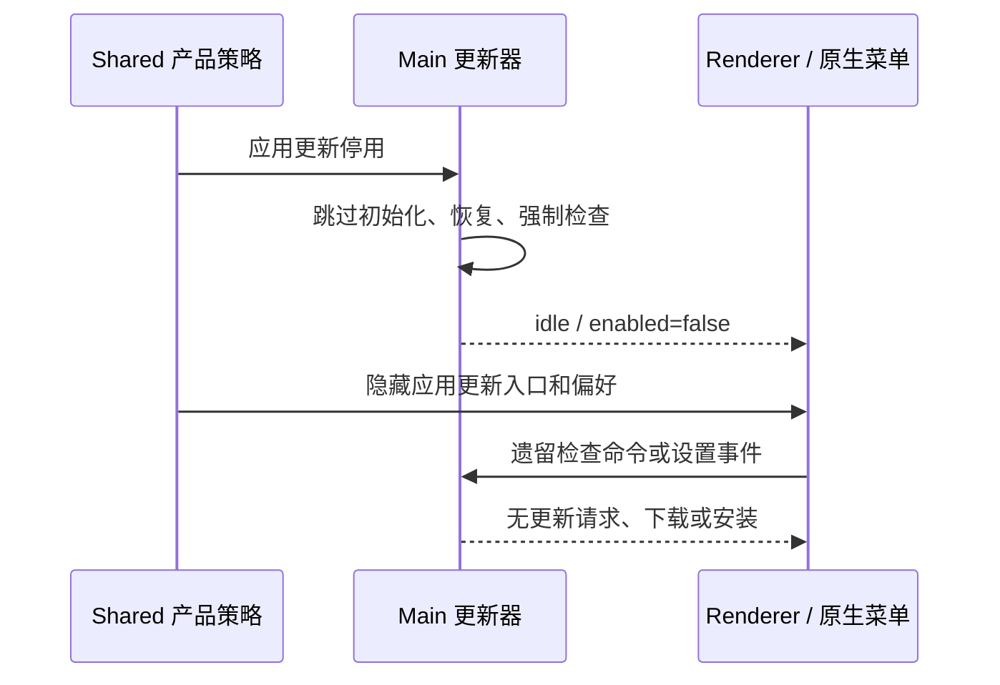

# 修改版桌面更新策略

## 行为与所有者

- 修改版只通过本仓库 Release 手动下载升级，不检查、下载或安装官方应用更新。
- `@zcode/shared` 的 `ZCODE_APP_UPDATES_ENABLED` 是唯一产品策略，固定为 `false`；不增加环境变量、设置项或持久化文件。
- Main 的更新器仍是更新状态唯一所有者，返回 `idle / enabled: false`。启动检查、定时检查、手动命令、更新渠道刷新和强制升级检查均不得发出更新请求。
- Renderer 帮助菜单、macOS 应用菜单、Windows 托盘、顶部更新按钮、预览更新和自动下载安装设置不显示更新入口。
- 沿用原有应用身份和数据目录。已有更新偏好与待展示更新记录不迁移、不删除，修改版不恢复其中的更新状态。
- 插件更新不属于应用更新，保持原有行为。

## 验收

1. 即使已有自动下载、预览更新和待安装版本设置，生产包仍正常启动，无官方应用更新请求和更新按钮。
2. 手动调用旧检查命令、刷新更新渠道后，状态保持停用，不创建更新轮询或请求。
3. 帮助菜单、原生菜单、托盘与通用设置没有应用更新入口；插件更新仍可见。
4. 重新构建 Windows x64 ZIP，核对包内提交号并发布 `v3.14.0-mod.2`。
