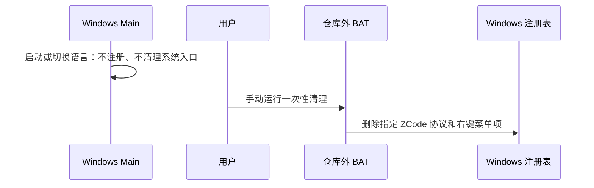

# 修改版 Windows 系统入口策略

## 行为与边界

- Windows 桌面进程启动时不注册 `zcode://` 协议；开发态与打包态采用同一规则。
- 不创建或更新文件夹、磁盘的“在 ZCode 中打开”右键菜单，切换语言时同样不写入这些注册表项。
- Main 是系统集成的唯一调用方。Windows 运行时不新增系统入口，也不自动删除、迁移或修复已有登记项。
- 保留接收链接、OAuth/支付回调、分享导入和 `--open-workspace` 参数的处理能力；手动配置的入口仍可投递这些请求。
- macOS/Linux 的现有运行时注册行为保持不变，本次不修改安装器行为。
- 用户数据、Electron 会话数据和子任务输出采用原有目录，不随本次改动清理。

## 一次性清理

- 清理脚本单独放在仓库外，由用户手动执行；程序不调用它，脚本不随应用打包。
- 脚本只删除 Windows 的 `zcode` 协议关联、`ZCode.OpenInZCode` 文件夹/磁盘菜单及对应的用户协议选择项。
- 处理当前用户和机器范围的同名登记项；查询不到的项明确显示为跳过，删除失败会报告错误并提示以管理员身份重跑。
- 提供 `/check` 只读检查模式。默认执行清理；不删除用户数据、绿色版文件、快捷方式或其他应用的登记项。

## 验收

1. Windows 中调用协议注册入口，不调用 Electron 的注册或移除协议 API，也不执行平台注册器。
2. 启动和切换语言均不再调用 Windows 右键菜单安装器，移除无其他调用方的实现。
3. macOS 仍调用原有协议注册 API，既有链接解析和业务路由保持原样。
4. 仓库外 BAT 仅包含以上指定登记项的清理，重复执行可跳过已不存在的项。
