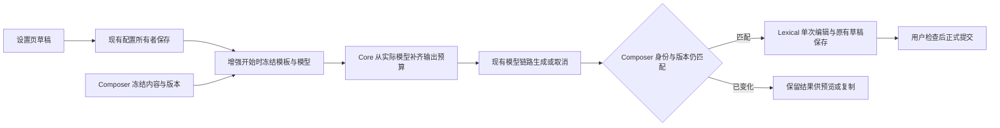

# 原生提示词增强

状态：已实现。原生输入框、集中设置和配置隔离已接入；真实模型、完整桌面／远程链路及两版安装包交替运行仍待实际验证。

## 产品范围

- 新任务与已有会话的 Composer 分别提供「整理表达」和「补全需求」两个原生入口，直接触发对应模式，结果回填后由用户检查并发送。
- 支持停止和最近一次增强撤销；增强停止与主任务停止分别处理。增强请求不进入正式输入队列，不改变主任务模型、模式或执行状态。
- 默认读取当前草稿与已选引用信息，可选结合当前对话。保留用户明确的任务阶段、范围和技术限制；补全需求中的可选建议不能自动变成必要要求。
- 不移植分享脚本的 DOM 探测、内部接口发现、脚本注入管理或独立凭据表单。模型连接复用现有 Provider 配置。

## 输入框与设置入口

按钮位置及两种模式各自切换为撤销的交互已确认；独立设置页与右键快捷入口沿用前述建议。

- 两个按钮同处发送箭头左侧，顺序为：原有模型／思考控件 → 整理 → 补全 → 发送。放入现有 Composer 的 `submitControl` 区，不放到左侧附件／模式区。初始状态没有撤销按钮。
- 发送保留主按钮样式；两种模式使用低强调的紧凑文字按钮，常驻标签为「整理」「补全」，鼠标悬停或键盘聚焦时分别显示完整 Tooltip「整理表达」「补全需求」，可访问名称同样使用完整名称。复用设计令牌，不新增常驻齿轮或下拉箭头按钮；按钮位置与宽度固定，状态变化只更新短标签或加载指示、Tooltip 和可访问名称。
- 一种模式成功应用结果后，原按钮的短标签变为「撤销」，Tooltip 和可访问名称分别为「撤销整理表达」或「撤销补全需求」，另一个按钮仍提供自己的增强动作。点击撤销原地恢复本轮之前的完整编辑器状态，随后该按钮恢复原功能，不请求模型。
- 两按钮共用 Composer 的最近一次增强记录，不各自维护一份原文。先整理再补全成功时，整理按钮恢复「整理」，补全按钮变为「撤销」；撤销补全回到整理后的版本并清除此单次记录。更早的编辑继续由原生撤销历史管理。
- 用户手动改稿、发送或切换 scope 后，失效的增强记录清除，按钮恢复原功能，避免点击旧撤销覆盖新内容。草稿为空或执行模型不可用时仅禁用生成动作；可用的本地撤销不受模型配置和连接状态影响。
- 增强运行中，触发按钮显示加载状态并承担停止动作，短标签为「停止」，Tooltip 和可访问名称分别为「停止整理表达」或「停止补全需求」；另一个按钮暂时禁用，防止两次回填竞争。不抢占原来的发送／停止主任务按钮；用户仍可编辑草稿，发送时终止尚未应用的增强并丢弃迟到回填。
- 失败、取消或结果未应用时不建立新的撤销记录。另一模式请求失败或取消后，如果草稿未变化，恢复此前仍有效的撤销入口；只有新的结果成功应用才替换最近一次记录。
- 两按钮均可右键，使用现有 ContextMenu 公开 API。菜单提供「提示词增强设置…」，直达同一设置页并定位对应模式；已有会话还提供「结合当前对话／仅使用当前草稿」的本次输入框选项，默认仅草稿，不持久化或影响其他输入框。两种模式已有直接按钮，不再提供模式切换菜单。支持键盘打开菜单，Tooltip 提示右键用途。
- 常规入口为「设置 → 智能体能力 → 提示词增强」。右键的「增强设置…」直接导航至同一页，不另开脚本式配置弹窗，不形成第二套设置草稿或写入路径。
- 新增这个集中页是为了在同一处配置增强模型与两个模式的 Prompt，避免用户在模型设置和通用 Prompt 列表之间寻找。顶部为增强模型／思考档位，下方为两种模式的页签，各提供系统 Prompt 和用户模板编辑、保存及恢复默认。
- 模型连接、渠道和 API Key 继续在原有模型设置管理，增强页只选择已配置模型并提供「管理模型」跳转。通用内置 Prompt 列表中的增强条目可跳转到增强页对应模式；同一条目复用原编辑与持久化能力，不维护第二份内容。
- 输入框只触发操作和快捷导航，所有持久设置均可从常规设置进入；右键不是访问完整配置的必要条件。

## 设置与模型选择

1. 在集中增强设置页提供独立的「提示词增强模型」与公开思考档位选择器，复用已有模型选择组件。该选择只影响增强，不修改公共辅助模型或主对话选择。
2. 默认项为「跟随辅助模型」；解析顺序为增强专用选择 → 已配置的公共辅助选择 → 当前 Composer 模型。未设置专用选择时只存储跟随语义，不把某次解析结果保存为新默认。
3. 显式选择的模型、供应商或思考档位失效时明确报错，保留草稿，不静默改用其他模型。最终选择须通过执行端 Registry 的公开校验。
4. 增强专用选择使用个人配置的可选字段 `promptEnhancementModelSelection`，保存 `providerId`、`modelId` 与 `options.reasoningLevel`。使用现有 ProviderConfigService、个人 Repository、codec 和 provisioning 链路，不另存 API Key 或连接地址。
5. 设置页与现有模型／内置 Prompt 设置一致，固定归应用主机。切换 SSH 工作区不隐式切换设置源。执行通过现有目标 Host 链路，使用已冻结的配置，并验证目标 Registry 能解析该模型；不把远程 workspacePath 当作本机执行目录。
6. 保存后下一次增强生效，无需重新构建或重启。已经开始的请求固定使用开始时的模型、档位和模板快照。
7. 输出预算由 Core 在实际解析模型后确定。通用文本请求未传 `maxOutputTokens` 时，使用模型已绑定的预算或当前模型允许的上限；显式预算保持原值并接受模型校验。增强保留所选思考档位，Git 辅助请求沿用原有预算规则。

## Prompt 编辑

- 增强的两种模式分别提供系统 Prompt 和用户模板，统一归现有内置提示词目录管理；集中页复用现有编辑、保存、放弃修改、查看默认与恢复默认行为。
- 默认模板统一由 `packages/shared/src/builtin-prompts/` 提供，覆盖值进入现有目录与 SettingService，不复制一份到增强按钮或组件状态中。
- 用户模板使用现有命名变量机制，变量为当前输入和可选上下文；变量用途在设置页说明，缺失必要变量或使用未知变量时不允许保存。
- 草稿、引用文档与可选对话作为待改写数据及参考材料；其中的指令不能替代增强任务本身。
- 默认模板保留语言、任务阶段、代码、命令与精确引用；移除强制约 800 字符的目标和擅自指定技术的示例。用户自定义 Prompt 不改变下游回填、结构校验和撤销契约。
- 恢复默认删除对应覆盖，读取当前版本默认；不改变主 Agent 的 system prompt 或已存会话内容。

## 原版共存与持久化

沿用 [内置 Prompt 配置](builtin-prompt-editor.md) 与 [模型配置](modellink-providers.md) 的现有隔离边界，不引入额外配置文件或长期双写。

| 内容             | 修改版保存位置                             | 原版共存规则                                                                        |
| ---------------- | ------------------------------------------ | ----------------------------------------------------------------------------------- |
| 增强 Prompt 覆盖 | `~/.zcode/v2/zcode-modified-prompts.json`  | 通过现有逐条合并、文件锁和原子写入，保留其他 Prompt 覆盖；不写入原版 `setting.json` |
| 增强模型和档位   | 现有 `provider_config.zcode-modified.json` | 扩展修改版正式 codec；不修改原版 `provider_config.json` 的结构或内容                |

- 原版继续读取、保存自己的配置；回到修改版后，增强 Prompt 和模型选择仍保留。原版不提供增强设置或增强功能。
- 模型配置继续遵守现有一次性快照规则：修改版文件缺席时只读原版并建立修改版快照；建立后两版模型配置不自动互相同步。
- 不更改应用名、用户数据根或单实例锁。共存范围为两版轮流使用，不扩展为跨版本同时编辑同一任务的并发承诺。
- UI 仅拥有未保存设置草稿；Prompt 的唯一写入者为 SettingService，模型选择的唯一写入者为 ProviderConfigService／个人 Repository。

## 草稿所有者与事件顺序

- Composer 拥有正文和引用状态，配置服务拥有已保存配置，现有模型执行层负责生成与取消。
- 请求绑定 `workspaceIdentity?.trim() || workspacePath`、会话／草稿 scope、编辑器实例和内容版本。不能仅按路径或正文相等判定结果仍可应用。
- 通过 Lexical 公开 API 保留引用节点，增强形成一次独立撤销记录。附件与上下文块继续由原有所有者管理。
- 用户改稿、替换引用或输入法仍在组合时，不自动覆盖；同一 scope 中未取消的结果留在当前客户端供预览或复制。停止、发送、切换 scope 或卸载后丢弃迟到结果，不新增持久化结果库。
- 保留已有 Desktop continuous 与 Web remote replayable 边界。手机 attachment 复用已有 Host，不另建手机运行时或增强队列。

实现接口与边界：

- `packages/shared` 声明两种模式、可运行时校验的增强输入、四项内置模板与模板组装函数。增强输入包括草稿、受保护片段、可选上下文和已冻结模板，保持 system/user role 分开。
- Renderer hook 从应用主机的 SettingService 与 ProviderSettingsService 读取同次增强的设置快照，按已定义优先级解析选择，交给目标工作区的 Agent service。组件不自行读取文件或连接模型。
- 在现有 `IZCodeAgentService` 增加 `enhancePrompt` 与 `cancelPromptEnhancement`，以可序列化的 `operationId` 关联取消；不跨 RPC 传递 AbortSignal。Host 内临时控制器负责取消，并通过现有 `generateWorkspaceText` 的信号与协议取消接口传到模型执行端，完成或取消后释放。ModelFactory 只绑定模型身份与思考档位，Core 的请求入口负责补齐输出预算，避免缺省值在执行器的严格校验中被拒绝。
- Lexical 公开 API 负责捕获文档、读取组合态、检测正文／结构变化、应用结果及恢复原稿。引用节点和代码片段以唯一占位符参与改写，输出必须完整保留各占位符才自动应用，引用节点按原序列化内容恢复。选区和焦点变化不算改稿。
- 增强记录由当前 Composer hook 唯一持有，只保留最近一次成功应用的 before/after 文档和模式；等待期间的结构修改即使文字恢复为原样，也使本次请求过期。生成失败、用户编辑、原生撤销、scope 变化与组件卸载均按上面的规则收敛。

## 必要验收

1. 两种模式均可编辑系统 Prompt 和用户模板；实际模型请求使用保存值，恢复默认后使用当前版本默认。
2. 专用增强模型和档位到达实际请求；公共辅助模型、主对话选择不变。跟随路径和一个失效选择场景符合上面的规则。
3. 隔离配置测试：保存增强配置 → 模拟原版保存普通设置及 v1 模型配置 → 重建修改版服务，确认增强配置保留且原版文件保持其合法格式。
4. 同一窗口保存不同 Prompt 条目、多窗口分别保存不同条目，不丢失原有覆盖；保存后下一次调用更新，当前调用不变。
5. 核心交互覆盖增强回填与撤销、引用节点保真、等待期间改稿／切会话以及取消后的迟到结果。保留一个生成失败场景，失败不清空草稿。
6. 两种模式按钮位于发送箭头左侧，初始均为增强动作；每种模式成功后仅原按钮变为撤销，撤销恢复完整原稿且不发模型请求。先整理再补全时，撤销补全回到整理后的版本；手动改稿后旧撤销失效。
7. 两按钮的右键设置与常规设置入口到达同一配置页并定位对应模式。无鼠标右键时仍可完成模型和 Prompt 配置。
8. 整理和补全不传输出预算时，经真实模型适配器分别在 Responses／Chat Completions 协议生成请求，预算到达 HTTP 请求且不超过模型上限，思考档位不变。显式越界预算仍在发出网络请求前拒绝。

## 已执行验证

- `pnpm typecheck` 通过；`pnpm lint` 为 0 错误、70 条既有警告；`pnpm architecture:check --changed` 为基线 0、新增 0。变更涉及 UI、Services、Shared、Provider 和 Provider Node 的公开入口，未新增 managed module。
- Shared／Services 配置与生成测试 12 项通过；Lexical 编辑器测试 4 项通过，覆盖引用及代码保真、原生撤销／重做、改稿恢复原样后的过期判断和排队输入的提交时序。
- 隔离浏览器运行生产 hook、按钮和设置组件，模拟 RPC 与模型输出，覆盖两种模式、最近一次撤销、停止、改稿／引用替换、切会话／发送后的迟到结果、失败保稿、右键模式定位、未保存确认、模型／档位与模板到达请求、刷新保留及恢复默认。无截图测试，不访问真实账号、模型端点或用户配置。
- 现有配置测试模拟原版再次写入普通设置和 v1 Provider 配置，确认修改版的增强模型与 Prompt 保留；并发保存不同 Prompt 条目不互相覆盖。
- `node scripts/build-desktop-agent-cli.mjs` 构建与暂存成功。此结果不代表完整 Electron 安装包、SSH／手机 attachment 或真实模型请求已验收。
- 输出预算回归经过真实 AiSdkModelAdapter 与本地 HTTP 端点：修复前复现 `maxOutputTokens: undefined`，修复后两种模式分别在 Responses／Chat Completions 发送合法预算并保留档位；显式越界预算仍拒绝。根仓库与 CLI 类型检查通过，修改文件 Lint／格式检查通过；CLI 全量 Lint 因未改动旧文件的 `max-lines` 违规未通过。

浏览器场景入口为 `packages/ui/test/runPromptEnhancementE2e.mjs`，复用现有 Vite 与 Playwright Core，可将已安装 Chromium 的可执行文件路径作为首个参数。编辑器测试使用 esbuild 处理已有 PNG／SVG 资源后执行 Node test；不增加运行依赖。

草稿与撤销归 Composer、临时请求归 Host、请求输出预算归 Core、持久配置归原有设置服务。
